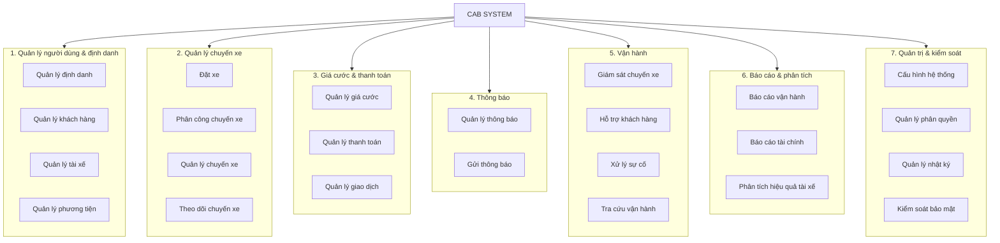

# CAB System – Domain tổng thể và Subdomain

## 1. Domain tổng thể

Toàn bộ hệ thống được tổ chức thành một **Domain tổng thể – CAB System**, bao gồm 7 Domain nghiệp vụ. Mỗi Domain được phân rã thành các Subdomain có trách nhiệm nghiệp vụ riêng theo hướng **High Cohesion**.



---

# 2. Phân rã Domain thành Subdomain

## 2.1. Quản lý người dùng & định danh

```text
Quản lý người dùng & định danh
│
├── Quản lý định danh
├── Quản lý khách hàng
├── Quản lý tài xế
└── Quản lý phương tiện
```

## 2.2. Quản lý chuyến xe

```text
Quản lý chuyến xe
│
├── Đặt xe
├── Phân công chuyến xe
├── Quản lý chuyến xe
└── Theo dõi chuyến xe
```

## 2.3. Giá cước & thanh toán

```text
Giá cước & thanh toán
│
├── Quản lý giá cước
├── Quản lý thanh toán
└── Quản lý giao dịch
```

## 2.4. Thông báo

```text
Thông báo
│
├── Quản lý thông báo
└── Gửi thông báo
```

## 2.5. Vận hành

```text
Vận hành
│
├── Giám sát chuyến xe
├── Hỗ trợ khách hàng
├── Xử lý sự cố
└── Tra cứu vận hành
```

## 2.6. Báo cáo & phân tích

```text
Báo cáo & phân tích
│
├── Báo cáo vận hành
├── Báo cáo tài chính
└── Phân tích hiệu quả tài xế
```

## 2.7. Quản trị & kiểm soát

```text
Quản trị & kiểm soát
│
├── Cấu hình hệ thống
├── Quản lý phân quyền
├── Quản lý nhật ký
└── Kiểm soát bảo mật
```

---

# 3. Tổng hợp cấu trúc Domain

```text
CAB SYSTEM
│
├── 1. Quản lý người dùng & định danh
│   ├── Quản lý định danh
│   ├── Quản lý khách hàng
│   ├── Quản lý tài xế
│   └── Quản lý phương tiện
│
├── 2. Quản lý chuyến xe
│   ├── Đặt xe
│   ├── Phân công chuyến xe
│   ├── Quản lý chuyến xe
│   └── Theo dõi chuyến xe
│
├── 3. Giá cước & thanh toán
│   ├── Quản lý giá cước
│   ├── Quản lý thanh toán
│   └── Quản lý giao dịch
│
├── 4. Thông báo
│   ├── Quản lý thông báo
│   └── Gửi thông báo
│
├── 5. Vận hành
│   ├── Giám sát chuyến xe
│   ├── Hỗ trợ khách hàng
│   ├── Xử lý sự cố
│   └── Tra cứu vận hành
│
├── 6. Báo cáo & phân tích
│   ├── Báo cáo vận hành
│   ├── Báo cáo tài chính
│   └── Phân tích hiệu quả tài xế
│
└── 7. Quản trị & kiểm soát
    ├── Cấu hình hệ thống
    ├── Quản lý phân quyền
    ├── Quản lý nhật ký
    └── Kiểm soát bảo mật
```

## 4. Tổng kết

* **Domain tổng thể:** CAB System
* **Số Domain:** 7
* **Số Subdomain:** 27

Các Subdomain được phân nhóm theo từng Domain dựa trên trách nhiệm nghiệp vụ, đảm bảo mỗi Subdomain tập trung vào một nhóm chức năng có tính liên kết cao.
