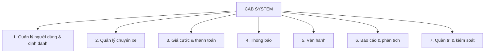
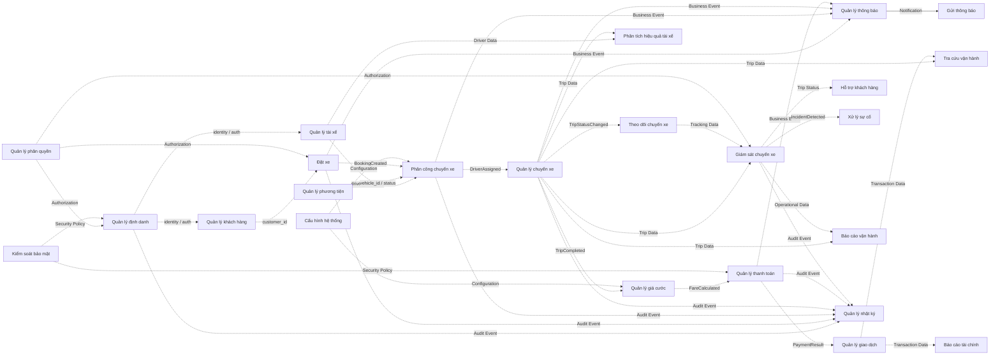

# CAB System – Domain, Subdomain & Loose Coupling

## 1. Mục tiêu

Tài liệu trình bày thiết kế Domain của hệ thống CAB theo hai nguyên tắc:

* **High Cohesion:** mỗi Subdomain tập trung vào một nhóm nghiệp vụ có cùng mục tiêu và trách nhiệm.
* **Loose Coupling:** các Subdomain chỉ trao đổi thông tin hoặc sự kiện nghiệp vụ cần thiết, hạn chế phụ thuộc vào dữ liệu và xử lý nội bộ của nhau.

---

# 2. Domain tổng thể

Toàn bộ hệ thống được xem là một **Domain tổng thể – CAB System**.



## 2.1. Bảy Domain

| STT | Domain                             | Phạm vi nghiệp vụ                                               |
| --: | ---------------------------------- | --------------------------------------------------------------- |
|   1 | **Quản lý người dùng & định danh** | Quản lý người dùng, xác thực, khách hàng, tài xế và phương tiện |
|   2 | **Quản lý chuyến xe**              | Đặt xe, phân công, quản lý và theo dõi chuyến xe                |
|   3 | **Giá cước & thanh toán**          | Tính giá cước, thanh toán và giao dịch                          |
|   4 | **Thông báo**                      | Quản lý và gửi thông báo                                        |
|   5 | **Vận hành**                       | Giám sát, hỗ trợ và xử lý sự cố                                 |
|   6 | **Báo cáo & phân tích**            | Báo cáo vận hành, tài chính và hiệu quả tài xế                  |
|   7 | **Quản trị & kiểm soát**           | Cấu hình, phân quyền, nhật ký và bảo mật                        |

---

# 3. Phân rã Subdomain theo High Cohesion

## 3.1. Domain 1 – Quản lý người dùng & định danh

| Subdomain               | Trách nhiệm                                          |
| ----------------------- | ---------------------------------------------------- |
| **Quản lý định danh**   | Đăng ký, đăng nhập, đăng xuất và xác thực người dùng |
| **Quản lý khách hàng**  | Quản lý thông tin và hồ sơ khách hàng                |
| **Quản lý tài xế**      | Quản lý thông tin và trạng thái làm việc của tài xế  |
| **Quản lý phương tiện** | Quản lý thông tin phương tiện                        |

---

## 3.2. Domain 2 – Quản lý chuyến xe

| Subdomain               | Trách nhiệm                              |
| ----------------------- | ---------------------------------------- |
| **Đặt xe**              | Tiếp nhận và quản lý yêu cầu đặt xe      |
| **Phân công chuyến xe** | Tìm và phân công tài xế phù hợp          |
| **Quản lý chuyến xe**   | Quản lý vòng đời và trạng thái chuyến xe |
| **Theo dõi chuyến xe**  | Theo dõi trạng thái và vị trí chuyến xe  |

---

## 3.3. Domain 3 – Giá cước & thanh toán

| Subdomain              | Trách nhiệm                                  |
| ---------------------- | -------------------------------------------- |
| **Quản lý giá cước**   | Xác định và tính số tiền khách hàng phải trả |
| **Quản lý thanh toán** | Xử lý thanh toán                             |
| **Quản lý giao dịch**  | Lưu và tra cứu kết quả giao dịch             |

---

## 3.4. Domain 4 – Thông báo

| Subdomain             | Trách nhiệm                                          |
| --------------------- | ---------------------------------------------------- |
| **Quản lý thông báo** | Quản lý các thông báo phát sinh từ sự kiện nghiệp vụ |
| **Gửi thông báo**     | Gửi thông báo qua Push Notification, SMS và Email    |

---

## 3.5. Domain 5 – Vận hành

| Subdomain              | Trách nhiệm                                       |
| ---------------------- | ------------------------------------------------- |
| **Giám sát chuyến xe** | Theo dõi các chuyến đang diễn ra                  |
| **Hỗ trợ khách hàng**  | Hỗ trợ khách hàng trong quá trình sử dụng dịch vụ |
| **Xử lý sự cố**        | Xử lý các trường hợp chuyến bị lỗi                |
| **Tra cứu vận hành**   | Tra cứu chuyến xe và giao dịch phục vụ vận hành   |

---

## 3.6. Domain 6 – Báo cáo & phân tích

| Subdomain                     | Trách nhiệm                                 |
| ----------------------------- | ------------------------------------------- |
| **Báo cáo vận hành**          | Tổng hợp số chuyến, tỷ lệ hoàn thành và hủy |
| **Báo cáo tài chính**         | Tổng hợp doanh thu và dữ liệu thanh toán    |
| **Phân tích hiệu quả tài xế** | Phân tích dữ liệu hoạt động của tài xế      |

---

## 3.7. Domain 7 – Quản trị & kiểm soát

| Subdomain              | Trách nhiệm                            |
| ---------------------- | -------------------------------------- |
| **Cấu hình hệ thống**  | Quản lý cấu hình hệ thống              |
| **Quản lý phân quyền** | Quản lý vai trò và quyền truy cập      |
| **Quản lý nhật ký**    | Ghi nhận và tra cứu hoạt động hệ thống |
| **Kiểm soát bảo mật**  | Kiểm soát các yêu cầu bảo mật          |

---

# 4. Tổng hợp Subdomain

Hệ thống gồm **7 Domain và 27 Subdomain**:

```text
CAB SYSTEM
│
├── 1. Quản lý người dùng & định danh
│   ├── Quản lý định danh
│   ├── Quản lý khách hàng
│   ├── Quản lý tài xế
│   └── Quản lý phương tiện
│
├── 2. Quản lý chuyến xe
│   ├── Đặt xe
│   ├── Phân công chuyến xe
│   ├── Quản lý chuyến xe
│   └── Theo dõi chuyến xe
│
├── 3. Giá cước & thanh toán
│   ├── Quản lý giá cước
│   ├── Quản lý thanh toán
│   └── Quản lý giao dịch
│
├── 4. Thông báo
│   ├── Quản lý thông báo
│   └── Gửi thông báo
│
├── 5. Vận hành
│   ├── Giám sát chuyến xe
│   ├── Hỗ trợ khách hàng
│   ├── Xử lý sự cố
│   └── Tra cứu vận hành
│
├── 6. Báo cáo & phân tích
│   ├── Báo cáo vận hành
│   ├── Báo cáo tài chính
│   └── Phân tích hiệu quả tài xế
│
└── 7. Quản trị & kiểm soát
    ├── Cấu hình hệ thống
    ├── Quản lý phân quyền
    ├── Quản lý nhật ký
    └── Kiểm soát bảo mật
```

---

# 5. Quan hệ giữa các Subdomain theo Loose Coupling

## 5.1. Nguyên tắc

Các Subdomain **không truy cập trực tiếp CSDL của nhau**.

Không thiết kế:

```text
Subdomain A
      │
      └── Truy cập trực tiếp Database của Subdomain B
```

Thay vào đó:

```text
Subdomain A
      │
      └── ID / dữ liệu cần thiết / Business Event
                    │
                    ↓
              Subdomain B
```

Các thông tin trao đổi có thể gồm:

* `customer_id`
* `driver_id`
* `vehicle_id`
* `booking_id`
* `trip_id`
* `transaction_id`
* Trạng thái nghiệp vụ
* Kết quả nghiệp vụ
* Business Event

---

# 6. Quan hệ giữa các Subdomain chính

## 6.1. Quản lý định danh → Quản lý khách hàng / Quản lý tài xế

```text
                 Quản lý định danh
                         │
             identity_id / auth result
                    ┌────┴────┐
                    ↓         ↓
          Quản lý khách hàng  Quản lý tài xế
```

---

## 6.2. Quản lý khách hàng → Đặt xe

```text
Quản lý khách hàng
        │
        └── customer_id ──→ Đặt xe
```

Subdomain `Đặt xe` chỉ cần thông tin cần thiết để xác định khách hàng thực hiện yêu cầu.

---

## 6.3. Quản lý tài xế / Quản lý phương tiện → Phân công chuyến xe

```text
Quản lý tài xế ──────────┐
                         ├──→ Phân công chuyến xe
Quản lý phương tiện ─────┘
```

Thông tin trao đổi:

```text
driver_id
vehicle_id
trạng thái sẵn sàng
loại xe
```

---

## 6.4. Đặt xe → Phân công chuyến xe

```text
Đặt xe
  │
  └── BookingCreated
          │
          ↓
Phân công chuyến xe
```

Thông tin chính:

```text
booking_id
điểm đón
điểm đến
loại xe
```

---

## 6.5. Phân công chuyến xe → Quản lý chuyến xe

```text
Phân công chuyến xe
        │
        └── DriverAssigned
                │
                ↓
        Quản lý chuyến xe
```

Thông tin chính:

```text
trip_id
driver_id
vehicle_id
```

---

## 6.6. Quản lý chuyến xe → Theo dõi chuyến xe

```text
Quản lý chuyến xe
        │
        └── TripStatusChanged
                │
                ↓
        Theo dõi chuyến xe
```

Thông tin chính:

```text
trip_id
trạng thái
vị trí
```

---

# 7. Quan hệ Giá cước & Thanh toán

```text
Quản lý chuyến xe
        │
        └── TripCompleted
                ↓
        Quản lý giá cước
                │
                └── FareCalculated
                        ↓
                Quản lý thanh toán
                        │
                        └── PaymentResult
                                ↓
                        Quản lý giao dịch
```

Thông tin trao đổi:

```text
trip_id
fare_amount
transaction_id
payment_method
payment_status
```

Mỗi Subdomain chỉ cung cấp kết quả nghiệp vụ cần thiết cho Subdomain tiếp theo.

---

# 8. Quan hệ với Domain Thông báo

**Thông báo là một Domain độc lập**, không phải Subdomain của Domain khác.

```text
Đặt xe ────────────────┐
Phân công chuyến xe ───┤
Quản lý chuyến xe ─────┤
Quản lý thanh toán ────┤
                       ↓
              Quản lý thông báo
                       ↓
                 Gửi thông báo
```

Các Business Event có thể gồm:

```text
BookingCreated
DriverAssigned
TripStatusChanged
TripCompleted
PaymentCompleted
```

Các Subdomain nghiệp vụ chỉ phát sinh sự kiện nghiệp vụ. Subdomain `Gửi thông báo` chịu trách nhiệm giao tiếp với Push Notification, SMS và Email.

---

# 9. Quan hệ với Domain Vận hành

```text
Quản lý chuyến xe ─────→ Giám sát chuyến xe
Theo dõi chuyến xe ────→ Giám sát chuyến xe
Giám sát chuyến xe ────→ Xử lý sự cố
Giám sát chuyến xe ────→ Hỗ trợ khách hàng

Quản lý chuyến xe ─────┐
Quản lý giao dịch ─────┴──→ Tra cứu vận hành
```

Các Subdomain vận hành chỉ nhận thông tin cần thiết để thực hiện chức năng của mình.

---

# 10. Quan hệ với Domain Báo cáo & phân tích

```text
Quản lý chuyến xe ─────┐
Giám sát chuyến xe ────┴──→ Báo cáo vận hành

Quản lý giao dịch ─────────→ Báo cáo tài chính

Quản lý tài xế ────────┐
Quản lý chuyến xe ─────┴──→ Phân tích hiệu quả tài xế
```

Báo cáo và phân tích chỉ sử dụng dữ liệu cần thiết, không cập nhật dữ liệu nghiệp vụ của Subdomain nguồn.

---

# 11. Quan hệ với Domain Quản trị & kiểm soát

## 11.1. Quản lý phân quyền

```text
Quản lý phân quyền
        │
        ├──→ Quản lý định danh
        ├──→ Đặt xe
        ├──→ Phân công chuyến xe
        ├──→ Quản lý chuyến xe
        └──→ Các chức năng cần kiểm soát quyền
```

Thông tin trao đổi:

```text
role
permission
authorization result
```

## 11.2. Cấu hình hệ thống

```text
Cấu hình hệ thống
        │
        ├──→ Quản lý giá cước
        ├──→ Phân công chuyến xe
        └──→ Các Subdomain sử dụng cấu hình
```

## 11.3. Các Subdomain nghiệp vụ → Quản lý nhật ký

```text
Quản lý định danh ──────┐
Đặt xe ─────────────────┤
Phân công chuyến xe ────┤
Quản lý chuyến xe ──────┤
Quản lý thanh toán ─────┤
Giám sát chuyến xe ─────┤
                       ↓
                Quản lý nhật ký
```

Các Subdomain nghiệp vụ phát sinh **Audit Event**, còn `Quản lý nhật ký` chịu trách nhiệm ghi nhận và tra cứu.

## 11.4. Kiểm soát bảo mật

```text
Kiểm soát bảo mật
        │
        ├──→ Quản lý định danh
        ├──→ Quản lý thanh toán
        └──→ Các Subdomain xử lý dữ liệu cần bảo vệ
```

---

# 12. Sơ đồ quan hệ tổng thể giữa các Subdomain



---

# 13. Bảng tổng hợp quan hệ Loose Coupling

| STT | Subdomain nguồn   | Subdomain đích     | Thông tin / Event        |
| --: | ----------------- | ------------------ | ------------------------ |
|   1 | Quản lý định danh | Quản lý khách hàng | identity_id, auth result |
|   2 | Quản lý định da   |                    |                          |
