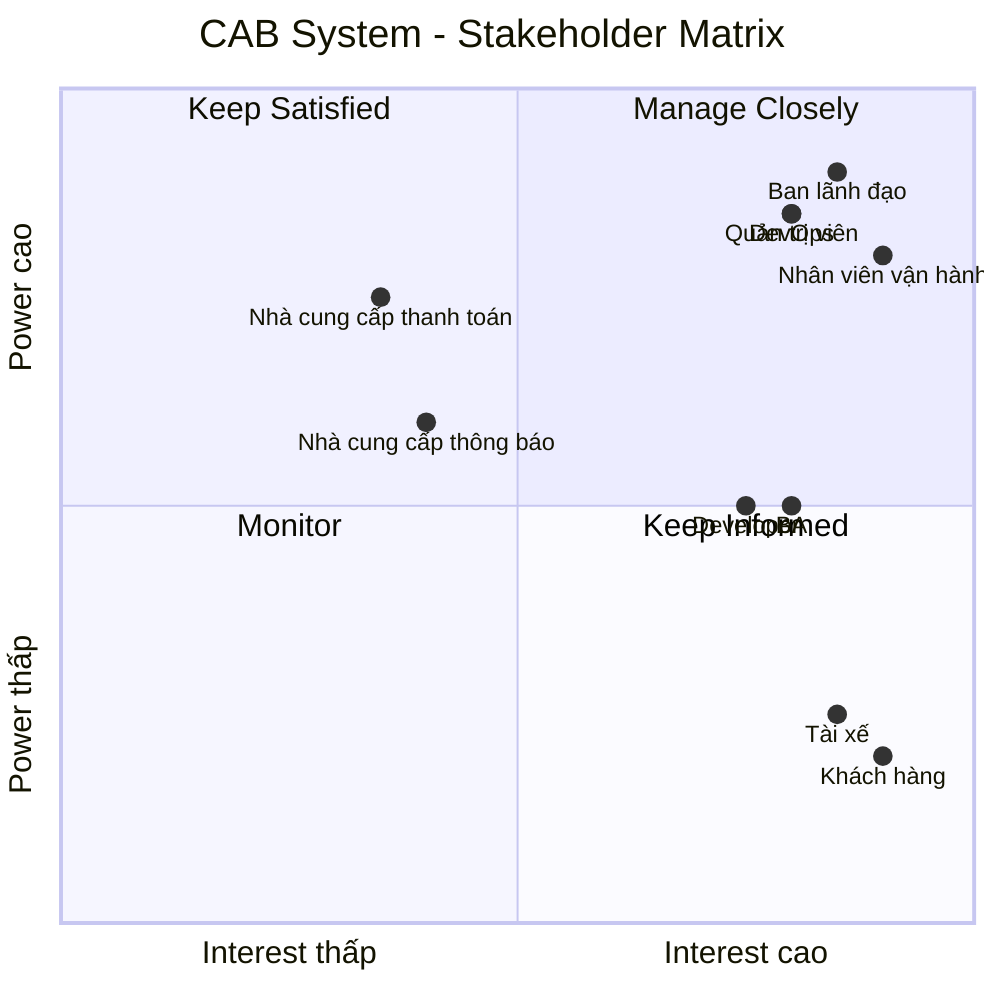

# 23638491_NgoHuuLoc_cabsystem
B1 : thống hiện tại còn những yếu điểm nào ?
-	Việc phân công tài xế chủ yếu được thực hiện thủ công
-	 Khách hàng khó theo dõi trạng thái chuyến đi
-	Thông tin thanh toán chưa được quản lý tập trung và bộ phận vận hành gặp khó khăn khi muốn mở rộng hệ thống
## B2. Xác định Stakeholder và vai trò

| STT | Stakeholder | Vai trò | Mối quan tâm / Nhu cầu |
|:---:|---|---|---|
| 1 | **Khách hàng** | Sử dụng dịch vụ đặt xe | Đặt xe, theo dõi chuyến đi, thanh toán và đánh giá tài xế |
| 2 | **Tài xế** | Nhận và thực hiện chuyến xe | Nhận chuyến, cập nhật trạng thái, quản lý hồ sơ và phương tiện |
| 3 | **Nhân viên vận hành** | Điều phối và quản lý hoạt động | Quản lý khách hàng, tài xế, chuyến đi và xử lý sự cố |
| 4 | **Quản trị viên hệ thống** | Quản trị hệ thống và phân quyền | Quản lý tài khoản, quyền truy cập và cấu hình hệ thống |
| 5 | **Ban lãnh đạo / Quản lý doanh nghiệp** | Quản lý hoạt động kinh doanh | Theo dõi doanh thu, số lượng chuyến và hiệu quả hoạt động |
| 6 | **Nhà cung cấp dịch vụ thanh toán** | Xử lý thanh toán điện tử | Xử lý giao dịch và trả kết quả thanh toán |
| 7 | **Nhà cung cấp dịch vụ thông báo** | Cung cấp dịch vụ gửi thông báo | Gửi SMS, Email, Push Notification và các kênh khác |
| 8 | **Business Analyst (BA)** | Phân tích nghiệp vụ và yêu cầu | Thu thập, phân tích và làm rõ yêu cầu |
| 9 | **Đội phát triển / Developer** | Xây dựng hệ thống | Phát triển, tích hợp và bảo trì các chức năng |
| 10 | **DevOps / Đội vận hành kỹ thuật** | Triển khai và duy trì hệ thống | Đảm bảo hệ thống ổn định, khả năng mở rộng và xử lý sự cố |

## B3. Stakeholder Matrix

## B4: Xác định phạm vi trong 7 tuần xây dựng CAB
| STT | Domain                             | Các module chính                                                 |
| :-: | ---------------------------------- | ---------------------------------------------------------------- |
|  1  | **Quản lý người dùng & định danh** | Người dùng, đăng nhập, xác thực, phân quyền, tài xế, phương tiện |
|  2  | **Quản lý chuyến xe**              | Đặt xe, tìm tài xế, phân công tài xế, quản lý chuyến, vị trí     |
|  3  | **Giá cước & thanh toán**          | Tính cước, thanh toán, lịch sử giao dịch                         |
|  4  | **Thông báo**                      | Push Notification, SMS, Email                                    |
|  5  | **Vận hành**                       | Theo dõi chuyến, quản lý tài xế, xử lý sự cố, hỗ trợ khách hàng  |
|  6  | **Báo cáo & phân tích**            | Doanh thu, số chuyến, tỷ lệ hoàn thành/hủy, hiệu quả tài xế      |
|  7  | **Quản trị & kiểm soát**           | Cấu hình hệ thống, bảo mật, phân quyền, audit log                |

## B5: Chuyển yêu cầu thành Business Requirement
| ID           | MVP Business Requirement                                                                          |
| ------------ | ------------------------------------------------------------------------------------------------- |
| **MVP-BR01** | Hệ thống phải cho phép khách hàng đăng ký, đăng nhập và sử dụng dịch vụ đặt xe.                   |
| **MVP-BR02** | Hệ thống phải cho phép khách hàng tạo yêu cầu đặt xe với thông tin điểm đón, điểm đến và loại xe. |
| **MVP-BR03** | Hệ thống phải tự động tìm và phân công tài xế phù hợp cho yêu cầu đặt xe.                         |
| **MVP-BR04** | Hệ thống phải cho phép tài xế nhận/từ chối chuyến và cập nhật trạng thái chuyến.                  |
| **MVP-BR05** | Hệ thống phải cho phép khách hàng theo dõi trạng thái chuyến và thông tin tài xế.                 |
| **MVP-BR06** | Hệ thống phải quản lý việc tính cước và số tiền khách hàng cần thanh toán.                        |
| **MVP-BR07** | Hệ thống phải hỗ trợ thanh toán tiền mặt và ít nhất một phương thức thanh toán điện tử.           |
| **MVP-BR08** | Hệ thống phải gửi thông báo về các sự kiện quan trọng của chuyến đi.                              |
| **MVP-BR09** | Nhân viên vận hành phải có khả năng giám sát chuyến, tài xế và xử lý các trường hợp lỗi cơ bản.   |
| **MVP-BR10** | Hệ thống phải đảm bảo xác thực, phân quyền, bảo mật dữ liệu và lưu vết các thao tác quan trọng.   |
## B6 : Phân rã các yêu cầu chức năng .
| BR        | ID          | Yêu cầu chức năng                                                                                                            |
| --------- | ----------- | ---------------------------------------------------------------------------------------------------------------------------- |
| **BR-01** | **FR-01.1** | Hệ thống cho phép khách hàng đăng ký tài khoản.                                                                              |
|           | **FR-01.2** | Hệ thống cho phép khách hàng và tài xế đăng nhập, đăng xuất.                                                                 |
|           | **FR-01.3** | Hệ thống cho phép khách hàng và tài xế cập nhật thông tin cá nhân.                                                           |
|           | **FR-01.4** | Hệ thống cho phép tài xế được nhân viên vận hành tạo tài khoản.                                                              |
| **BR-02** | **FR-02.1** | Khách hàng nhập điểm đón và điểm đến.                                                                                        |
|           | **FR-02.2** | Khách hàng lựa chọn loại xe/dịch vụ.                                                                                         |
|           | **FR-02.3** | Khách hàng gửi yêu cầu đặt xe.                                                                                               |
|           | **FR-02.4** | Hệ thống tạo và lưu thông tin yêu cầu đặt xe.                                                                                |
|           | **FR-02.5** | Hệ thống thông báo cho khách hàng khi yêu cầu đặt xe được tiếp nhận.                                                         |
| **BR-03** | **FR-03.1** | Hệ thống xác định các tài xế đang ở trạng thái **Sẵn sàng (Available)**.                                                     |
|           | **FR-03.2** | Hệ thống chỉ lựa chọn tài xế **Available** phù hợp với loại xe/dịch vụ.                                                      |
|           | **FR-03.3** | Hệ thống ưu tiên tài xế phù hợp và gần điểm đón.                                                                             |
|           | **FR-03.4** | Hệ thống gửi yêu cầu chuyến đến tài xế được lựa chọn.                                                                        |
|           | **FR-03.5** | Tài xế có thể chấp nhận hoặc từ chối yêu cầu chuyến.                                                                         |
|           | **FR-03.6** | Nếu tài xế từ chối hoặc không phản hồi, hệ thống tiếp tục tìm tài xế **Available** khác.                                     |
|           | **FR-03.7** | Khi tài xế nhận chuyến, hệ thống gán tài xế cho chuyến và chuyển tài xế sang trạng thái **Đang thực hiện chuyến (On Trip)**. |
|           | **FR-03.8** | Nếu không tìm được tài xế Available phù hợp, hệ thống thông báo cho khách hàng.                                              |
| **BR-04** | **FR-04.1** | Tài xế có thể chuyển trạng thái sang **Sẵn sàng (Available)** khi đang làm việc.                                             |
|           | **FR-04.2** | Tài xế có thể chuyển trạng thái không sẵn sàng khi không muốn nhận chuyến.                                                   |
|           | **FR-04.3** | Tài xế nhận thông báo khi có yêu cầu chuyến phù hợp.                                                                         |
|           | **FR-04.4** | Tài xế có thể chấp nhận hoặc từ chối chuyến.                                                                                 |
|           | **FR-04.5** | Tài xế cập nhật trạng thái chuyến: **Đã đến điểm đón → Đã đón khách → Đang di chuyển → Hoàn thành**.                         |
| **BR-05** | **FR-05.1** | Khách hàng xem trạng thái hiện tại của chuyến.                                                                               |
|           | **FR-05.2** | Khách hàng xem thông tin tài xế đã nhận chuyến.                                                                              |
|           | **FR-05.3** | Hệ thống cung cấp vị trí hiện tại của tài xế cho các chức năng cần thiết.                                                    |
|           | **FR-05.4** | Hệ thống cung cấp thời gian dự kiến tài xế đến.                                                                              |
|           | **FR-05.5** | Khách hàng xem lịch sử chuyến đi.                                                                                            |
| **BR-06** | **FR-06.1** | Hệ thống xác định số tiền khách hàng phải trả sau khi chuyến hoàn thành.                                                     |
|           | **FR-06.2** | Hệ thống lưu thông tin cước của chuyến.                                                                                      |
|           | **FR-06.3** | Khách hàng xem số tiền phải thanh toán.                                                                                      |
| **BR-07** | **FR-07.1** | Khách hàng có thể lựa chọn thanh toán bằng tiền mặt.                                                                         |
|           | **FR-07.2** | Khách hàng có thể lựa chọn thanh toán điện tử.                                                                               |
|           | **FR-07.3** | Hệ thống gửi yêu cầu thanh toán đến nhà cung cấp thanh toán bên ngoài.                                                       |
|           | **FR-07.4** | Hệ thống nhận và lưu kết quả giao dịch thanh toán.                                                                           |
|           | **FR-07.5** | Hệ thống thông báo kết quả thanh toán cho khách hàng.                                                                        |
|           | **FR-07.6** | Hệ thống hỗ trợ xử lý lại giao dịch thanh toán thất bại theo chính sách doanh nghiệp.                                        |
| **BR-08** | **FR-08.1** | Hệ thống thông báo cho khách hàng khi yêu cầu đặt xe được tiếp nhận.                                                         |
|           | **FR-08.2** | Hệ thống thông báo khi tài xế nhận chuyến.                                                                                   |
|           | **FR-08.3** | Hệ thống thông báo khi tài xế đến điểm đón.                                                                                  |
|           | **FR-08.4** | Hệ thống thông báo khi chuyến hoàn thành.                                                                                    |
|           | **FR-08.5** | Hệ thống thông báo kết quả thanh toán.                                                                                       |
|           | **FR-08.6** | Hệ thống thông báo cho tài xế khi có chuyến mới hoặc có thay đổi liên quan đến chuyến.                                       |
| **BR-09** | **FR-09.1** | Nhân viên vận hành đăng nhập vào hệ thống quản trị.                                                                          |
|           | **FR-09.2** | Nhân viên vận hành xem danh sách các chuyến đang diễn ra.                                                                    |
|           | **FR-09.3** | Nhân viên vận hành xem trạng thái của tài xế.                                                                                |
|           | **FR-09.4** | Nhân viên vận hành quản lý thông tin khách hàng, tài xế và phương tiện.                                                      |
|           | **FR-09.5** | Nhân viên vận hành tra cứu lịch sử chuyến và giao dịch.                                                                      |
|           | **FR-09.6** | Nhân viên vận hành hỗ trợ xử lý các trường hợp chuyến bị lỗi.                                                                |
| **BR-10** | **FR-10.1** | Hệ thống yêu cầu khách hàng và tài xế xác thực trước khi sử dụng chức năng yêu cầu tài khoản.                                |
|           | **FR-10.2** | Hệ thống kiểm soát quyền truy cập đối với các chức năng quản trị.                                                            |
|           | **FR-10.3** | Hệ thống bảo vệ thông tin cá nhân, thông tin phương tiện, dữ liệu vị trí và dữ liệu giao dịch.                               |
|           | **FR-10.4** | Hệ thống không lưu trực tiếp thông tin nhạy cảm của thẻ hoặc tài khoản thanh toán.                                           |
|           | **FR-10.5** | Hệ thống lưu vết các thao tác quan trọng để phục vụ kiểm tra và xử lý sự cố.                                                 |
##B7 : USECASE 
## Use Case Diagram - CAB System

##B8 : Đặc tả USECASE
##B9 : Phân tích quy trình nghiệp vụ ( Business Process ) 
##B10 : Phân tích quy tắc nghiệp vụ ( Business Rule ) 
