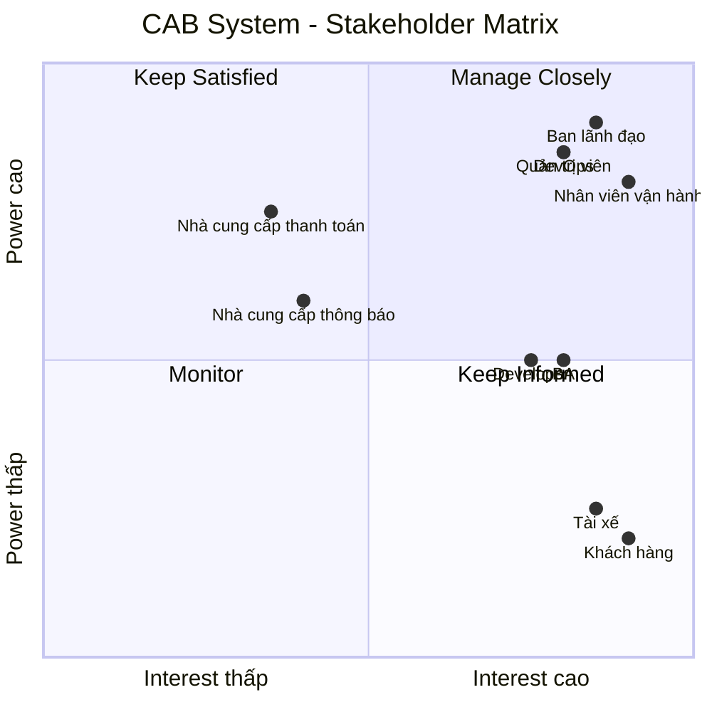
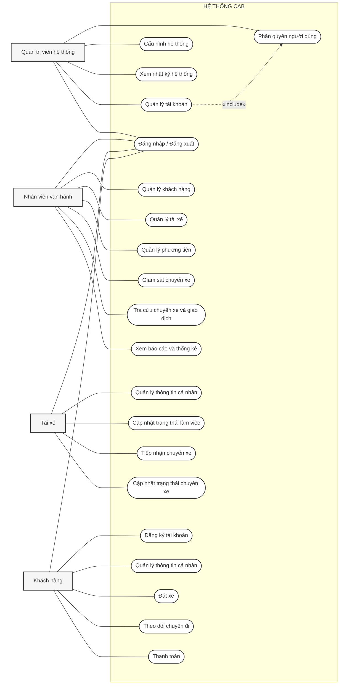

# 23638491_NgoHuuLoc_cabsystem
B1 : thống hiện tại còn những yếu điểm nào ?
-	Việc phân công tài xế chủ yếu được thực hiện thủ công
-	 Khách hàng khó theo dõi trạng thái chuyến đi
-	Thông tin thanh toán chưa được quản lý tập trung và bộ phận vận hành gặp khó khăn khi muốn mở rộng hệ thống
## B2. Xác định Stakeholder và vai trò

| STT | Stakeholder | Vai trò | Mối quan tâm / Nhu cầu |
|:---:|---|---|---|
| 1 | **Khách hàng** | Sử dụng dịch vụ đặt xe | Đặt xe, theo dõi chuyến đi, thanh toán và đánh giá tài xế |
| 2 | **Tài xế** | Nhận và thực hiện chuyến xe | Nhận chuyến, cập nhật trạng thái, quản lý hồ sơ và phương tiện |
| 3 | **Nhân viên vận hành** | Điều phối và quản lý hoạt động | Quản lý khách hàng, tài xế, chuyến đi và xử lý sự cố |
| 4 | **Quản trị viên hệ thống** | Quản trị hệ thống và phân quyền | Quản lý tài khoản, quyền truy cập và cấu hình hệ thống |
| 5 | **Ban lãnh đạo / Quản lý doanh nghiệp** | Quản lý hoạt động kinh doanh | Theo dõi doanh thu, số lượng chuyến và hiệu quả hoạt động |
| 6 | **Nhà cung cấp dịch vụ thanh toán** | Xử lý thanh toán điện tử | Xử lý giao dịch và trả kết quả thanh toán |
| 7 | **Nhà cung cấp dịch vụ thông báo** | Cung cấp dịch vụ gửi thông báo | Gửi SMS, Email, Push Notification và các kênh khác |
| 8 | **Business Analyst (BA)** | Phân tích nghiệp vụ và yêu cầu | Thu thập, phân tích và làm rõ yêu cầu |
| 9 | **Đội phát triển / Developer** | Xây dựng hệ thống | Phát triển, tích hợp và bảo trì các chức năng |
| 10 | **DevOps / Đội vận hành kỹ thuật** | Triển khai và duy trì hệ thống | Đảm bảo hệ thống ổn định, khả năng mở rộng và xử lý sự cố |

## B3. Stakeholder Matrix

## B4: Xác định phạm vi trong 7 tuần xây dựng CAB
| STT | Domain                             | Các module chính                                                 |
| :-: | ---------------------------------- | ---------------------------------------------------------------- |
|  1  | **Quản lý người dùng & định danh** | Người dùng, đăng nhập, xác thực, phân quyền, tài xế, phương tiện |
|  2  | **Quản lý chuyến xe**              | Đặt xe, tìm tài xế, phân công tài xế, quản lý chuyến, vị trí     |
|  3  | **Giá cước & thanh toán**          | Tính cước, thanh toán, lịch sử giao dịch                         |
|  4  | **Thông báo**                      | Push Notification, SMS, Email                                    |
|  5  | **Vận hành**                       | Theo dõi chuyến, quản lý tài xế, xử lý sự cố, hỗ trợ khách hàng  |
|  6  | **Báo cáo & phân tích**            | Doanh thu, số chuyến, tỷ lệ hoàn thành/hủy, hiệu quả tài xế      |
|  7  | **Quản trị & kiểm soát**           | Cấu hình hệ thống, bảo mật, phân quyền, audit log                |

## B5: Chuyển yêu cầu thành Business Requirement
| ID           | MVP Business Requirement                                                                          |
| ------------ | ------------------------------------------------------------------------------------------------- |
| **MVP-BR01** | Hệ thống phải cho phép khách hàng đăng ký, đăng nhập và sử dụng dịch vụ đặt xe.                   |
| **MVP-BR02** | Hệ thống phải cho phép khách hàng tạo yêu cầu đặt xe với thông tin điểm đón, điểm đến và loại xe. |
| **MVP-BR03** | Hệ thống phải tự động tìm và phân công tài xế phù hợp cho yêu cầu đặt xe.                         |
| **MVP-BR04** | Hệ thống phải cho phép tài xế nhận/từ chối chuyến và cập nhật trạng thái chuyến.                  |
| **MVP-BR05** | Hệ thống phải cho phép khách hàng theo dõi trạng thái chuyến và thông tin tài xế.                 |
| **MVP-BR06** | Hệ thống phải quản lý việc tính cước và số tiền khách hàng cần thanh toán.                        |
| **MVP-BR07** | Hệ thống phải hỗ trợ thanh toán tiền mặt và ít nhất một phương thức thanh toán điện tử.           |
| **MVP-BR08** | Hệ thống phải gửi thông báo về các sự kiện quan trọng của chuyến đi.                              |
| **MVP-BR09** | Nhân viên vận hành phải có khả năng giám sát chuyến, tài xế và xử lý các trường hợp lỗi cơ bản.   |
| **MVP-BR10** | Hệ thống phải đảm bảo xác thực, phân quyền, bảo mật dữ liệu và lưu vết các thao tác quan trọng.   |
## B6 : Phân rã các yêu cầu chức năng .
| BR        | ID          | Yêu cầu chức năng                                                                                                            |
| --------- | ----------- | ---------------------------------------------------------------------------------------------------------------------------- |
| **BR-01** | **FR-01.1** | Hệ thống cho phép khách hàng đăng ký tài khoản.                                                                              |
|           | **FR-01.2** | Hệ thống cho phép khách hàng và tài xế đăng nhập, đăng xuất.                                                                 |
|           | **FR-01.3** | Hệ thống cho phép khách hàng và tài xế cập nhật thông tin cá nhân.                                                           |
|           | **FR-01.4** | Hệ thống cho phép tài xế được nhân viên vận hành tạo tài khoản.                                                              |
| **BR-02** | **FR-02.1** | Khách hàng nhập điểm đón và điểm đến.                                                                                        |
|           | **FR-02.2** | Khách hàng lựa chọn loại xe/dịch vụ.                                                                                         |
|           | **FR-02.3** | Khách hàng gửi yêu cầu đặt xe.                                                                                               |
|           | **FR-02.4** | Hệ thống tạo và lưu thông tin yêu cầu đặt xe.                                                                                |
|           | **FR-02.5** | Hệ thống thông báo cho khách hàng khi yêu cầu đặt xe được tiếp nhận.                                                         |
| **BR-03** | **FR-03.1** | Hệ thống xác định các tài xế đang ở trạng thái **Sẵn sàng (Available)**.                                                     |
|           | **FR-03.2** | Hệ thống chỉ lựa chọn tài xế **Available** phù hợp với loại xe/dịch vụ.                                                      |
|           | **FR-03.3** | Hệ thống ưu tiên tài xế phù hợp và gần điểm đón.                                                                             |
|           | **FR-03.4** | Hệ thống gửi yêu cầu chuyến đến tài xế được lựa chọn.                                                                        |
|           | **FR-03.5** | Tài xế có thể chấp nhận hoặc từ chối yêu cầu chuyến.                                                                         |
|           | **FR-03.6** | Nếu tài xế từ chối hoặc không phản hồi, hệ thống tiếp tục tìm tài xế **Available** khác.                                     |
|           | **FR-03.7** | Khi tài xế nhận chuyến, hệ thống gán tài xế cho chuyến và chuyển tài xế sang trạng thái **Đang thực hiện chuyến (On Trip)**. |
|           | **FR-03.8** | Nếu không tìm được tài xế Available phù hợp, hệ thống thông báo cho khách hàng.                                              |
| **BR-04** | **FR-04.1** | Tài xế có thể chuyển trạng thái sang **Sẵn sàng (Available)** khi đang làm việc.                                             |
|           | **FR-04.2** | Tài xế có thể chuyển trạng thái không sẵn sàng khi không muốn nhận chuyến.                                                   |
|           | **FR-04.3** | Tài xế nhận thông báo khi có yêu cầu chuyến phù hợp.                                                                         |
|           | **FR-04.4** | Tài xế có thể chấp nhận hoặc từ chối chuyến.                                                                                 |
|           | **FR-04.5** | Tài xế cập nhật trạng thái chuyến: **Đã đến điểm đón → Đã đón khách → Đang di chuyển → Hoàn thành**.                         |
| **BR-05** | **FR-05.1** | Khách hàng xem trạng thái hiện tại của chuyến.                                                                               |
|           | **FR-05.2** | Khách hàng xem thông tin tài xế đã nhận chuyến.                                                                              |
|           | **FR-05.3** | Hệ thống cung cấp vị trí hiện tại của tài xế cho các chức năng cần thiết.                                                    |
|           | **FR-05.4** | Hệ thống cung cấp thời gian dự kiến tài xế đến.                                                                              |
|           | **FR-05.5** | Khách hàng xem lịch sử chuyến đi.                                                                                            |
| **BR-06** | **FR-06.1** | Hệ thống xác định số tiền khách hàng phải trả sau khi chuyến hoàn thành.                                                     |
|           | **FR-06.2** | Hệ thống lưu thông tin cước của chuyến.                                                                                      |
|           | **FR-06.3** | Khách hàng xem số tiền phải thanh toán.                                                                                      |
| **BR-07** | **FR-07.1** | Khách hàng có thể lựa chọn thanh toán bằng tiền mặt.                                                                         |
|           | **FR-07.2** | Khách hàng có thể lựa chọn thanh toán điện tử.                                                                               |
|           | **FR-07.3** | Hệ thống gửi yêu cầu thanh toán đến nhà cung cấp thanh toán bên ngoài.                                                       |
|           | **FR-07.4** | Hệ thống nhận và lưu kết quả giao dịch thanh toán.                                                                           |
|           | **FR-07.5** | Hệ thống thông báo kết quả thanh toán cho khách hàng.                                                                        |
|           | **FR-07.6** | Hệ thống hỗ trợ xử lý lại giao dịch thanh toán thất bại theo chính sách doanh nghiệp.                                        |
| **BR-08** | **FR-08.1** | Hệ thống thông báo cho khách hàng khi yêu cầu đặt xe được tiếp nhận.                                                         |
|           | **FR-08.2** | Hệ thống thông báo khi tài xế nhận chuyến.                                                                                   |
|           | **FR-08.3** | Hệ thống thông báo khi tài xế đến điểm đón.                                                                                  |
|           | **FR-08.4** | Hệ thống thông báo khi chuyến hoàn thành.                                                                                    |
|           | **FR-08.5** | Hệ thống thông báo kết quả thanh toán.                                                                                       |
|           | **FR-08.6** | Hệ thống thông báo cho tài xế khi có chuyến mới hoặc có thay đổi liên quan đến chuyến.                                       |
| **BR-09** | **FR-09.1** | Nhân viên vận hành đăng nhập vào hệ thống quản trị.                                                                          |
|           | **FR-09.2** | Nhân viên vận hành xem danh sách các chuyến đang diễn ra.                                                                    |
|           | **FR-09.3** | Nhân viên vận hành xem trạng thái của tài xế.                                                                                |
|           | **FR-09.4** | Nhân viên vận hành quản lý thông tin khách hàng, tài xế và phương tiện.                                                      |
|           | **FR-09.5** | Nhân viên vận hành tra cứu lịch sử chuyến và giao dịch.                                                                      |
|           | **FR-09.6** | Nhân viên vận hành hỗ trợ xử lý các trường hợp chuyến bị lỗi.                                                                |
| **BR-10** | **FR-10.1** | Hệ thống yêu cầu khách hàng và tài xế xác thực trước khi sử dụng chức năng yêu cầu tài khoản.                                |
|           | **FR-10.2** | Hệ thống kiểm soát quyền truy cập đối với các chức năng quản trị.                                                            |
|           | **FR-10.3** | Hệ thống bảo vệ thông tin cá nhân, thông tin phương tiện, dữ liệu vị trí và dữ liệu giao dịch.                               |
|           | **FR-10.4** | Hệ thống không lưu trực tiếp thông tin nhạy cảm của thẻ hoặc tài khoản thanh toán.                                           |
|           | **FR-10.5** | Hệ thống lưu vết các thao tác quan trọng để phục vụ kiểm tra và xử lý sự cố.                                                 |
##B7 : USECASE 
## Use Case Diagram - CAB System

##B8 : Đặc tả USECASE
# B8. ĐẶC TẢ USE CASE

---

# I. KHÁCH HÀNG

## UC01. Đăng ký tài khoản

| Mục | Nội dung |
|---|---|
| **Tiền điều kiện** | Khách hàng chưa có tài khoản trên hệ thống. Hệ thống đang hoạt động bình thường. |
| **Hậu điều kiện** | Nếu đăng ký thành công, tài khoản khách hàng được tạo và thông tin được lưu vào CSDL. Nếu đăng ký thất bại hoặc bị hủy, tài khoản không được tạo. |
| **Actor chính** | Khách hàng |
| **Actor phụ** | Không |

### Basic Flow

| Khách hàng | Hệ thống |
|---|---|
| 1. Chọn chức năng **"Đăng ký tài khoản"**. | 2. Hiển thị biểu mẫu đăng ký gồm: họ tên, số điện thoại, email, mật khẩu và xác nhận mật khẩu. |
| 3. Nhập đầy đủ thông tin đăng ký. | 4. Kiểm tra tính đầy đủ và hợp lệ của thông tin. |
| | 5. Kiểm tra số điện thoại/email đã tồn tại trong hệ thống hay chưa. |
| 6. Chọn **"Đăng ký"**. | 7. Tạo tài khoản khách hàng. |
| | 8. Lưu thông tin tài khoản vào CSDL. |
| | 9. Thông báo đăng ký tài khoản thành công. |

### Alternative Flow

#### 4.1. Thông tin đăng ký không hợp lệ

1. Hệ thống xác định trường thông tin không hợp lệ.
2. Hệ thống hiển thị thông báo lỗi tương ứng tại trường dữ liệu.
3. Khách hàng chỉnh sửa thông tin.
4. Quay lại bước 4.

#### 5.1. Số điện thoại hoặc email đã tồn tại

1. Hệ thống thông báo số điện thoại/email đã được sử dụng.
2. Khách hàng nhập thông tin khác.
3. Quay lại bước 4.

### Exception

#### 6.1. Khách hàng hủy đăng ký

1. Khách hàng chọn **"Hủy"**.
2. Hệ thống hiển thị thông báo xác nhận hủy.
3. Khách hàng xác nhận hủy.
4. Hệ thống không tạo tài khoản.
5. Kết thúc Use Case.

---

# II. TÀI XẾ

## UC02. Quản lý thông tin cá nhân

| Mục | Nội dung |
|---|---|
| **Tiền điều kiện** | Tài xế đã đăng nhập thành công. Tài khoản tài xế đang hoạt động. |
| **Hậu điều kiện** | Nếu cập nhật thành công, thông tin cá nhân mới được lưu vào CSDL. Nếu hủy hoặc dữ liệu không hợp lệ, thông tin cũ được giữ nguyên. |
| **Actor chính** | Tài xế |
| **Actor phụ** | Không |

### Basic Flow

| Tài xế | Hệ thống |
|---|---|
| 1. Chọn **"Quản lý thông tin cá nhân"**. | 2. Hiển thị trang thông tin cá nhân gồm: họ tên, số điện thoại, email và các thông tin cá nhân đã đăng ký của tài xế. |
| 3. Chọn **"Cập nhật"**. | 4. Hiển thị biểu mẫu cập nhật với các thông tin hiện tại. |
| 5. Chỉnh sửa thông tin cần thay đổi. | 6. Kiểm tra dữ liệu nhập. |
| 7. Chọn **"Lưu"**. | 8. Cập nhật thông tin mới vào CSDL. |
| | 9. Thông báo cập nhật thành công. |

### Alternative Flow

#### 6.1. Dữ liệu không hợp lệ

1. Hệ thống xác định trường dữ liệu không hợp lệ.
2. Hệ thống hiển thị thông báo lỗi.
3. Tài xế chỉnh sửa thông tin.
4. Quay lại bước 6.

### Exception

#### 7.1. Tài xế hủy cập nhật

1. Tài xế chọn **"Hủy"**.
2. Hệ thống không lưu thay đổi.
3. Giữ nguyên thông tin cũ.
4. Kết thúc Use Case.

---

## UC03. Cập nhật trạng thái làm việc

| Mục | Nội dung |
|---|---|
| **Tiền điều kiện** | Tài xế đã đăng nhập thành công. Tài khoản tài xế đang hoạt động. |
| **Hậu điều kiện** | Trạng thái làm việc mới được cập nhật và lưu vào CSDL. Nếu tài xế đang thực hiện chuyến xe, trạng thái **On Trip** được duy trì. |
| **Actor chính** | Tài xế |
| **Actor phụ** | Không |

### Basic Flow

| Tài xế | Hệ thống |
|---|---|
| 1. Chọn **"Cập nhật trạng thái làm việc"**. | 2. Hiển thị trạng thái hiện tại của tài xế và các trạng thái có thể lựa chọn. |
| | 3. Danh sách trạng thái gồm: **Available**, **On Trip** và các trạng thái được hệ thống quy định. |
| 4. Chọn trạng thái muốn cập nhật. | 5. Kiểm tra trạng thái hiện tại và trạng thái mới. |
| 6. Xác nhận cập nhật. | 7. Cập nhật trạng thái làm việc. |
| | 8. Lưu trạng thái mới vào CSDL. |
| | 9. Thông báo cập nhật thành công. |

### Alternative Flow

#### 5.1. Tài xế đang thực hiện chuyến xe

1. Hệ thống xác định tài xế đang ở trạng thái **On Trip**.
2. Hệ thống không cho phép chuyển sang **Available**.
3. Hệ thống thông báo tài xế đang thực hiện chuyến xe.
4. Kết thúc Use Case.

### Exception

#### 6.1. Tài xế hủy cập nhật

1. Tài xế chọn **"Hủy"**.
2. Hệ thống giữ nguyên trạng thái hiện tại.
3. Kết thúc Use Case.

---

## UC04. Tiếp nhận chuyến xe

| Mục | Nội dung |
|---|---|
| **Tiền điều kiện** | 1. Tài xế đã đăng nhập. 2. Tài xế đang ở trạng thái **Available**. 3. Hệ thống đã gửi yêu cầu chuyến đến tài xế. |
| **Hậu điều kiện** | **Chấp nhận:** Tài xế được gán vào chuyến và trạng thái làm việc chuyển thành **On Trip**. **Từ chối/không phản hồi:** Tài xế không được gán vào chuyến; hệ thống tiếp tục tìm tài xế phù hợp khác. |
| **Actor chính** | Tài xế |
| **Actor phụ** | Không |

### Basic Flow

| Tài xế | Hệ thống |
|---|---|
| | 1. Gửi thông báo có chuyến xe mới. |
| 2. Chọn thông báo chuyến xe. | 3. Hiển thị chi tiết yêu cầu chuyến gồm: mã chuyến, điểm đón, điểm đến, loại xe/dịch vụ và thông tin cần thiết của chuyến. |
| 4. Xem thông tin chuyến xe. | |
| 5. Chọn **"Chấp nhận"**. | 6. Kiểm tra trạng thái của tài xế và trạng thái yêu cầu chuyến. |
| | 7. Gán tài xế vào chuyến xe. |
| | 8. Cập nhật trạng thái tài xế thành **On Trip**. |
| | 9. Lưu thông tin gán chuyến vào CSDL. |
| | 10. Thông báo tiếp nhận chuyến thành công. |

### Alternative Flow

#### 5.1. Tài xế từ chối chuyến

1. Tài xế chọn **"Từ chối"**.
2. Hệ thống hiển thị yêu cầu xác nhận.
3. Tài xế xác nhận từ chối.
4. Hệ thống ghi nhận kết quả từ chối.
5. Hệ thống không gán chuyến cho tài xế.
6. Kết thúc Use Case.

#### 5.2. Tài xế không phản hồi

1. Hệ thống chờ phản hồi trong thời gian quy định.
2. Hết thời gian nhưng tài xế không phản hồi.
3. Hệ thống ghi nhận tài xế không phản hồi.
4. Không gán chuyến cho tài xế.
5. Kết thúc Use Case.

### Exception

#### 2.1. Chuyến xe không còn khả dụng

1. Tài xế mở yêu cầu chuyến.
2. Hệ thống kiểm tra và xác định chuyến đã được tài xế khác tiếp nhận hoặc đã bị hủy.
3. Hệ thống thông báo chuyến xe không còn khả dụng.
4. Không thực hiện gán chuyến.
5. Kết thúc Use Case.

---

## UC05. Cập nhật trạng thái chuyến xe

| Mục | Nội dung |
|---|---|
| **Tiền điều kiện** | 1. Tài xế đã đăng nhập. 2. Tài xế đã được gán vào chuyến xe. 3. Chuyến xe chưa ở trạng thái **Hoàn thành**. |
| **Hậu điều kiện** | Trạng thái chuyến xe được cập nhật thành công và lưu vào CSDL. Trạng thái được thực hiện theo đúng trình tự nghiệp vụ: **Đã đến điểm đón → Đã đón khách → Đang di chuyển → Hoàn thành**. |
| **Actor chính** | Tài xế |
| **Actor phụ** | Không |

### Basic Flow

| Tài xế | Hệ thống |
|---|---|
| 1. Chọn chuyến xe đang thực hiện. | 2. Hiển thị thông tin chuyến gồm: mã chuyến, điểm đón, điểm đến, thông tin khách hàng và trạng thái hiện tại. |
| 3. Chọn trạng thái **"Đã đến điểm đón"**. | 4. Kiểm tra trạng thái hiện tại. |
| | 5. Cập nhật trạng thái thành **Đã đến điểm đón**. |
| 6. Chọn trạng thái **"Đã đón khách"**. | 7. Kiểm tra trạng thái hiện tại phải là **Đã đến điểm đón**. |
| | 8. Cập nhật trạng thái thành **Đã đón khách**. |
| 9. Chọn trạng thái **"Đang di chuyển"**. | 10. Kiểm tra trạng thái hiện tại phải là **Đã đón khách**. |
| | 11. Cập nhật trạng thái thành **Đang di chuyển**. |
| 12. Chọn trạng thái **"Hoàn thành"**. | 13. Kiểm tra trạng thái hiện tại phải là **Đang di chuyển**. |
| | 14. Cập nhật trạng thái thành **Hoàn thành**. |
| | 15. Lưu trạng thái mới vào CSDL. |
| | 16. Thông báo chuyến xe đã hoàn thành. |

### Alternative Flow

#### 3.1. Cập nhật "Đã đến điểm đón"

1. Hệ thống kiểm tra trạng thái hiện tại.
2. Nếu trạng thái hợp lệ, hệ thống cập nhật thành **Đã đến điểm đón**.
3. Lưu thay đổi vào CSDL.

#### 6.1. Cập nhật "Đã đón khách"

1. Hệ thống kiểm tra trạng thái hiện tại là **Đã đến điểm đón**.
2. Cập nhật thành **Đã đón khách**.
3. Lưu thay đổi vào CSDL.

#### 9.1. Cập nhật "Đang di chuyển"

1. Hệ thống kiểm tra trạng thái hiện tại là **Đã đón khách**.
2. Cập nhật thành **Đang di chuyển**.
3. Lưu thay đổi vào CSDL.

### Exception

#### 3.2. Trạng thái không đúng trình tự

1. Tài xế chọn trạng thái không phù hợp.
2. Hệ thống từ chối cập nhật.
3. Hệ thống thông báo trạng thái không hợp lệ.
4. Hiển thị lại trạng thái hiện tại.
5. Quay lại bước 2.

---

# III. NHÂN VIÊN VẬN HÀNH

## UC06. Quản lý khách hàng

| Mục | Nội dung |
|---|---|
| **Tiền điều kiện** | Nhân viên vận hành đã đăng nhập và có quyền quản lý khách hàng. |
| **Hậu điều kiện** | Thông tin khách hàng được tạo hoặc cập nhật thành công và lưu vào CSDL. |
| **Actor chính** | Nhân viên vận hành |
| **Actor phụ** | Không |

### Basic Flow

| Nhân viên vận hành | Hệ thống |
|---|---|
| 1. Chọn **"Quản lý khách hàng"**. | 2. Hiển thị danh sách khách hàng gồm: mã khách hàng, họ tên, số điện thoại, email và trạng thái tài khoản. |
| 3. Chọn một khách hàng trong danh sách. | 4. Hiển thị thông tin chi tiết khách hàng gồm các thông tin đã đăng ký. |
| 5. Chọn **"Cập nhật"**. | 6. Hiển thị biểu mẫu cập nhật thông tin khách hàng. |
| 7. Chỉnh sửa thông tin. | 8. Kiểm tra dữ liệu. |
| 9. Chọn **"Lưu"**. | 10. Cập nhật thông tin vào CSDL. |
| | 11. Thông báo cập nhật thành công. |

### Alternative Flow

#### 2.1. Danh sách khách hàng có nhiều dữ liệu

1. Hệ thống phân trang danh sách.
2. Nhân viên chọn trang cần xem.
3. Hệ thống hiển thị danh sách khách hàng tương ứng.

#### 8.1. Thông tin không hợp lệ

1. Hệ thống thông báo trường dữ liệu không hợp lệ.
2. Nhân viên chỉnh sửa thông tin.
3. Quay lại bước 8.

### Exception

#### 9.1. Nhân viên hủy cập nhật

1. Nhân viên chọn **"Hủy"**.
2. Hệ thống không lưu thay đổi.
3. Giữ nguyên thông tin khách hàng.
4. Kết thúc Use Case.

---

## UC07. Quản lý tài xế

| Mục | Nội dung |
|---|---|
| **Tiền điều kiện** | Nhân viên vận hành đã đăng nhập và có quyền quản lý tài xế. |
| **Hậu điều kiện** | Thông tin tài xế được tạo hoặc cập nhật thành công và lưu vào CSDL. |
| **Actor chính** | Nhân viên vận hành |
| **Actor phụ** | Không |

### Basic Flow

| Nhân viên vận hành | Hệ thống |
|---|---|
| 1. Chọn **"Quản lý tài xế"**. | 2. Hiển thị danh sách tài xế gồm: mã tài xế, họ tên, số điện thoại, thông tin phương tiện và trạng thái làm việc. |
| 3. Chọn tài xế cần quản lý. | 4. Hiển thị thông tin chi tiết tài xế. |
| 5. Chọn **"Cập nhật"**. | 6. Hiển thị biểu mẫu cập nhật thông tin tài xế. |
| 7. Chỉnh sửa thông tin. | 8. Kiểm tra dữ liệu. |
| 9. Chọn **"Lưu"**. | 10. Cập nhật thông tin vào CSDL. |
| | 11. Thông báo cập nhật thành công. |

### Alternative Flow

#### 2.1. Có nhiều tài xế

1. Hệ thống phân trang danh sách.
2. Nhân viên chọn trang cần xem.
3. Hệ thống hiển thị danh sách tương ứng.

#### 8.1. Dữ liệu không hợp lệ

1. Hệ thống thông báo lỗi.
2. Nhân viên chỉnh sửa thông tin.
3. Quay lại bước 8.

### Exception

#### 9.1. Nhân viên hủy cập nhật

1. Nhân viên chọn **"Hủy"**.
2. Hệ thống không lưu thay đổi.
3. Kết thúc Use Case.

---

## UC08. Quản lý phương tiện

| Mục | Nội dung |
|---|---|
| **Tiền điều kiện** | Nhân viên vận hành đã đăng nhập và có quyền quản lý phương tiện. |
| **Hậu điều kiện** | Thông tin phương tiện được tạo hoặc cập nhật thành công và lưu vào CSDL. |
| **Actor chính** | Nhân viên vận hành |
| **Actor phụ** | Không |

### Basic Flow

| Nhân viên vận hành | Hệ thống |
|---|---|
| 1. Chọn **"Quản lý phương tiện"**. | 2. Hiển thị danh sách phương tiện gồm: mã phương tiện, biển số xe, loại xe, tài xế được phân công và trạng thái phương tiện. |
| 3. Chọn phương tiện cần quản lý. | 4. Hiển thị thông tin chi tiết phương tiện. |
| 5. Chọn **"Cập nhật"**. | 6. Hiển thị biểu mẫu cập nhật. |
| 7. Chỉnh sửa thông tin. | 8. Kiểm tra dữ liệu. |
| 9. Chọn **"Lưu"**. | 10. Lưu thông tin vào CSDL. |
| | 11. Thông báo cập nhật thành công. |

### Alternative Flow

#### 8.1. Biển số xe đã tồn tại

1. Hệ thống thông báo biển số xe đã được sử dụng.
2. Nhân viên nhập lại biển số.
3. Quay lại bước 8.

### Exception

#### 9.1. Nhân viên hủy cập nhật

1. Nhân viên chọn **"Hủy"**.
2. Hệ thống không lưu thay đổi.
3. Kết thúc Use Case.

---

## UC09. Giám sát chuyến xe

| Mục | Nội dung |
|---|---|
| **Tiền điều kiện** | Nhân viên vận hành đã đăng nhập và có quyền giám sát chuyến xe. |
| **Hậu điều kiện** | Thông tin chuyến xe và trạng thái hiện tại được hiển thị; dữ liệu được cập nhật theo trạng thái thực tế của chuyến. |
| **Actor chính** | Nhân viên vận hành |
| **Actor phụ** | Không |

### Basic Flow

| Nhân viên vận hành | Hệ thống |
|---|---|
| 1. Chọn **"Giám sát chuyến xe"**. | 2. Hiển thị danh sách chuyến xe đang hoạt động gồm: mã chuyến, thông tin khách hàng, tài xế, điểm đón, điểm đến và trạng thái chuyến. |
| 3. Chọn một chuyến xe. | 4. Hiển thị thông tin chi tiết chuyến xe. |
| | 5. Hiển thị trạng thái hiện tại của chuyến. |
| | 6. Hiển thị thông tin tài xế và phương tiện. |
| | 7. Cập nhật thông tin khi trạng thái chuyến thay đổi. |
| 8. Theo dõi chuyến xe. | |

### Alternative Flow

#### 2.1. Không có chuyến xe đang hoạt động

1. Hệ thống thông báo không có chuyến xe đang hoạt động.
2. Kết thúc Use Case.

### Exception

#### 3.1. Nhân viên kết thúc giám sát

1. Nhân viên chọn **"Thoát"**.
2. Hệ thống kết thúc thao tác.
3. Kết thúc Use Case.

---

# IV. QUẢN TRỊ VIÊN HỆ THỐNG

## UC10. Quản lý tài khoản

| Mục | Nội dung |
|---|---|
| **Tiền điều kiện** | Quản trị viên đã đăng nhập và có quyền quản lý tài khoản. |
| **Hậu điều kiện** | Tài khoản được tạo hoặc cập nhật thành công; thông tin được lưu vào CSDL. |
| **Actor chính** | Quản trị viên hệ thống |
| **Actor phụ** | Không |

### Basic Flow

| Quản trị viên | Hệ thống |
|---|---|
| 1. Chọn **"Quản lý tài khoản"**. | 2. Hiển thị danh sách tài khoản gồm: mã tài khoản, tên đăng nhập, họ tên người dùng, vai trò, trạng thái tài khoản và ngày tạo. |
| 3. Chọn tài khoản cần quản lý. | 4. Hiển thị thông tin chi tiết tài khoản. |
| 5. Chọn **"Cập nhật"**. | 6. Hiển thị biểu mẫu cập nhật tài khoản. |
| 7. Chỉnh sửa thông tin. | 8. Kiểm tra dữ liệu. |
| 9. Chọn **"Lưu"**. | 10. Cập nhật thông tin vào CSDL. |
| | 11. Thông báo cập nhật thành công. |

### Alternative Flow

#### 2.1. Có nhiều tài khoản

1. Hệ thống phân trang danh sách.
2. Quản trị viên chọn trang cần xem.
3. Hệ thống hiển thị danh sách tương ứng.

#### 8.1. Thông tin tài khoản không hợp lệ

1. Hệ thống thông báo lỗi.
2. Quản trị viên chỉnh sửa thông tin.
3. Quay lại bước 8.

### Exception

#### 9.1. Quản trị viên hủy thao tác

1. Quản trị viên chọn **"Hủy"**.
2. Hệ thống không lưu thay đổi.
3. Giữ nguyên thông tin tài khoản.
4. Kết thúc Use Case.

---

## UC11. Phân quyền người dùng

| Mục | Nội dung |
|---|---|
| **Tiền điều kiện** | Quản trị viên đã đăng nhập và có quyền phân quyền người dùng. Tài khoản cần phân quyền đã tồn tại. |
| **Hậu điều kiện** | Quyền của tài khoản được cập nhật và lưu vào CSDL. Nếu hủy, quyền hiện tại được giữ nguyên. |
| **Actor chính** | Quản trị viên hệ thống |
| **Actor phụ** | Không |

### Basic Flow

| Quản trị viên | Hệ thống |
|---|---|
| 1. Chọn **"Phân quyền người dùng"**. | 2. Hiển thị danh sách tài khoản gồm: mã tài khoản, tên đăng nhập, họ tên, vai trò và trạng thái tài khoản. |
| 3. Chọn tài khoản cần phân quyền. | 4. Hiển thị thông tin tài khoản và danh sách quyền hiện tại. |
| 5. Chọn hoặc bỏ chọn quyền. | 6. Hiển thị các quyền có thể cấp cho tài khoản. |
| 7. Xác nhận phân quyền. | 8. Kiểm tra quyền được lựa chọn. |
| | 9. Cập nhật quyền của tài khoản. |
| | 10. Lưu thông tin phân quyền vào CSDL. |
| | 11. Thông báo phân quyền thành công. |

### Alternative Flow

#### 6.1. Tài khoản không được phép cấp quyền

1. Hệ thống xác định tài khoản không thuộc phạm vi được phân quyền.
2. Hệ thống thông báo không thể thực hiện phân quyền.
3. Kết thúc Use Case.

### Exception

#### 7.1. Quản trị viên hủy phân quyền

1. Quản trị viên chọn **"Hủy"**.
2. Hệ thống không lưu thay đổi.
3. Giữ nguyên quyền hiện tại.
4. Kết thúc Use Case.

---

## UC12. Cấu hình hệ thống

| Mục | Nội dung |
|---|---|
| **Tiền điều kiện** | Quản trị viên đã đăng nhập và có quyền cấu hình hệ thống. |
| **Hậu điều kiện** | Cấu hình hợp lệ được lưu vào CSDL và được áp dụng cho hệ thống. Nếu hủy, cấu hình cũ được giữ nguyên. |
| **Actor chính** | Quản trị viên hệ thống |
| **Actor phụ** | Không |

### Basic Flow

| Quản trị viên | Hệ thống |
|---|---|
| 1. Chọn **"Cấu hình hệ thống"**. | 2. Hiển thị danh sách cấu hình gồm: tên cấu hình, giá trị hiện tại, đơn vị và trạng thái áp dụng. |
| 3. Chọn cấu hình cần thay đổi. | 4. Hiển thị thông tin cấu hình hiện tại. |
| 5. Nhập giá trị mới. | 6. Kiểm tra giá trị cấu hình. |
| 7. Chọn **"Lưu"**. | 8. Lưu cấu hình mới vào CSDL. |
| | 9. Áp dụng cấu hình mới. |
| | 10. Thông báo cập nhật thành công. |

### Alternative Flow

#### 6.1. Giá trị cấu hình không hợp lệ

1. Hệ thống thông báo giá trị không hợp lệ.
2. Quản trị viên nhập lại giá trị.
3. Quay lại bước 6.

### Exception

#### 7.1. Quản trị viên hủy cấu hình

1. Quản trị viên chọn **"Hủy"**.
2. Hệ thống không lưu cấu hình mới.
3. Giữ nguyên cấu hình hiện tại.
4. Kết thúc Use Case.

---

## UC13. Xem nhật ký hệ thống

| Mục | Nội dung |
|---|---|
| **Tiền điều kiện** | Quản trị viên đã đăng nhập và có quyền xem nhật ký hệ thống. |
| **Hậu điều kiện** | Các bản ghi nhật ký phù hợp với điều kiện tra cứu được hiển thị. |
| **Actor chính** | Quản trị viên hệ thống |
| **Actor phụ** | Không |

### Basic Flow

| Quản trị viên | Hệ thống |
|---|---|
| 1. Chọn **"Xem nhật ký hệ thống"**. | 2. Hiển thị danh sách nhật ký gồm: thời gian, tài khoản thực hiện, hành động, đối tượng tác động và kết quả thực hiện. |
| 3. Nhập điều kiện tra cứu. | 4. Kiểm tra điều kiện tra cứu. |
| 5. Chọn **"Tra cứu"**. | 6. Tìm kiếm các bản ghi phù hợp. |
| | 7. Hiển thị danh sách kết quả. |
| 8. Chọn một bản ghi. | 9. Hiển thị thông tin chi tiết của bản ghi. |

### Alternative Flow

#### 6.1. Không tìm thấy bản ghi

1. Hệ thống thông báo không tìm thấy dữ liệu phù hợp.
2. Quản trị viên thay đổi điều kiện tra cứu.
3. Quay lại bước 4.

### Exception

#### 5.1. Quản trị viên hủy tra cứu

1. Quản trị viên chọn **"Hủy"**.
2. Hệ thống kết thúc thao tác.
3. Kết thúc Use Case.
##B9 : Phân tích quy trình nghiệp vụ ( Business Process )
| Mã   | Quy trình nghiệp vụ             | Các bước thực hiện                                                                                                                                                                                                                                                                                                                            |
| ---- | ------------------------------- | --------------------------------------------------------------------------------------------------------------------------------------------------------------------------------------------------------------------------------------------------------------------------------------------------------------------------------------------- |
| BP01 | Quản lý và xác thực tài khoản   | 1. Người dùng đăng ký hoặc được cấp tài khoản. 2. Người dùng đăng nhập hệ thống. 3. Hệ thống xác thực thông tin. 4. Hệ thống xác định vai trò và quyền truy cập. 5. Người dùng sử dụng chức năng được cấp quyền. 6. Người dùng đăng xuất khi kết thúc.                                                                         |
| BP02 | Đặt xe và phân công tài xế      | 1. Khách hàng nhập thông tin chuyến đi và gửi yêu cầu đặt xe. 2. Hệ thống tiếp nhận yêu cầu. 3. Hệ thống tìm tài xế phù hợp đang sẵn sàng. 4. Hệ thống gửi yêu cầu đến tài xế. 5. Tài xế tiếp nhận chuyến xe. 6. Hệ thống phân công tài xế và cập nhật thông tin chuyến xe. 7. Hệ thống thông báo thông tin cho khách hàng. |
| BP03 | Thực hiện và theo dõi chuyến xe | 1. Tài xế di chuyển đến điểm đón. 2. Tài xế cập nhật trạng thái chuyến xe. 3. Hệ thống ghi nhận trạng thái. 4. Khách hàng theo dõi thông tin chuyến đi. 5. Tài xế hoàn thành chuyến xe. 6. Hệ thống cập nhật trạng thái hoàn thành.                                                                                            |
| BP04 | Tính cước và thanh toán         | 1. Hệ thống xác nhận chuyến xe hoàn thành. 2. Hệ thống tính cước phí. 3. Hệ thống hiển thị thông tin thanh toán. 4. Khách hàng thực hiện thanh toán. 5. Hệ thống xử lý và ghi nhận kết quả thanh toán. 6. Thông tin giao dịch được lưu lại.                                                                                    |
| BP05 | Quản lý và vận hành hệ thống    | 1. Nhân viên vận hành quản lý khách hàng, tài xế và phương tiện. 2. Giám sát và tra cứu thông tin chuyến xe, giao dịch. 3. Hệ thống tổng hợp dữ liệu báo cáo và thống kê. 4. Quản trị viên quản lý tài khoản và phân quyền. 5. Quản trị viên cấu hình và theo dõi nhật ký hệ thống.                                               |

##B10 : Phân tích quy tắc nghiệp vụ ( Business Rule ) 
| Mã | Nhóm | Quy tắc nghiệp vụ |
|---|---|---|
| BR01 | Tài khoản | Người dùng phải có tài khoản hợp lệ để sử dụng các chức năng yêu cầu xác thực. |
| BR02 | Phân quyền | Người dùng chỉ được truy cập các chức năng phù hợp với vai trò và quyền hạn được cấp. |
| BR03 | Đặt xe | Khách hàng phải cung cấp đầy đủ thông tin cần thiết khi tạo yêu cầu đặt xe. |
| BR04 | Phân công | Chỉ tài xế đang ở trạng thái sẵn sàng mới được hệ thống xem xét phân công chuyến xe. |
| BR05 | Phân công | Một chuyến xe chỉ được phân công cho một tài xế tại cùng một thời điểm. |
| BR06 | Phân công | Một tài xế không được thực hiện nhiều chuyến xe cùng lúc. |
| BR07 | Chuyến xe | Tài xế phải cập nhật trạng thái trong quá trình thực hiện chuyến xe. |
| BR08 | Theo dõi | Khách hàng chỉ được theo dõi thông tin của chuyến xe thuộc tài khoản của mình. |
| BR09 | Thanh toán | Cước phí được xác định dựa trên thông tin thực hiện của chuyến xe. |
| BR10 | Thanh toán | Thông tin thanh toán và kết quả giao dịch phải được lưu trong hệ thống. |
| BR11 | Vận hành | Nhân viên vận hành chỉ được thực hiện các chức năng thuộc quyền hạn được cấp. |
| BR12 | Quản trị | Quản trị viên có quyền quản lý tài khoản và phân quyền người dùng. |
| BR13 | Nhật ký | Các hoạt động quan trọng trong hệ thống cần được ghi nhận vào nhật ký hệ thống. |
